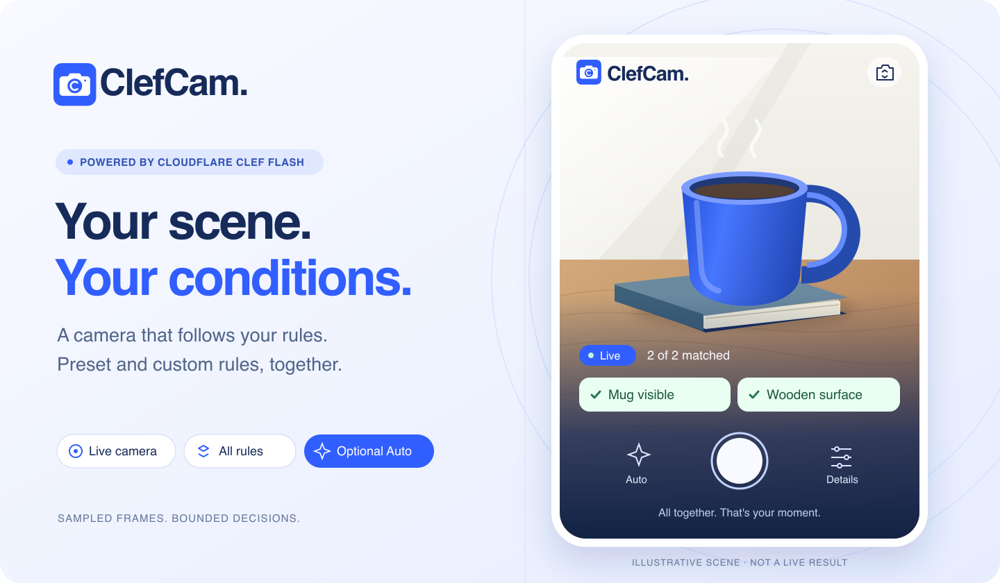

# ClefCam

**Point your camera. Pick your conditions. Keep the moment.**

ClefCam is a mobile web camera that checks a stack of visual rules using [Cloudflare Clef Flash](https://developers.cloudflare.com/workers-ai/models/clef-flash/). Choose presets or write a condition like “a red mug on a wooden table.” Watch each rule match, take a photo yourself, or arm Auto to capture when all enabled rules match together.

Clef makes bounded decisions about sampled frames; it does not generate descriptions or process a continuous video stream. The app is a small React/TypeScript frontend and a Cloudflare Worker with an AI binding and a Durable Object for usage limits. It deploys behind Cloudflare Access on your own account.

## A small camera app, a bigger pattern

ClefCam is a working starting point for inexpensive, repeated decisions. The camera gives it something to observe; Clef answers a few bounded questions; ordinary application code decides what happens next.

**Observe → check conditions → remember progress → act.**

In this app, that means checking a scene, remembering whether consecutive checks matched, and capturing a photo once. The same loop could advance a sequence, unlock a clue, update a checklist, or decide when another tool is worth calling. Clef supplies the judgments. Your application supplies memory, timing and actions.

A few directions to build from here—ideas, not features shipped or validated in ClefCam:

- **A hands-free shot list or process journal.** Check for the next scene in a sequence, capture it, then advance the checklist. The app remembers which steps are done, rather than asking the model to reconstruct the whole session.
- **A scavenger hunt or escape room made from ordinary objects.** Recognizing a mug, an open book or a particular combination could unlock the next clue. Game state and puzzle logic live in code.
- **A sketch checklist before image generation.** Check whether the requested elements are present while someone draws. Once the checklist is satisfied and the person confirms, make one more expensive generation call instead of generating on every revision.
- **A live semantic writing checklist.** Apply the pattern to text: does a draft state the decision, name an owner and include a next step? Update a few indicators as the text changes, while leaving the writing to its author.

Other small uses include waiting for a recognizable state in an agent's screenshot or notifying someone when a scene changes meaningfully. Each needs its own validation, uncertainty handling and sensible polling interval. The useful ingredient is a decision you can compose into software; the photo is just this example's action.

## Use it

1. **Open camera** and allow camera access, or **Choose rules first** to prepare a scene. Rear camera is the default; the switch button selects the front camera.
2. **Add rule** to choose presets or write a visible condition. Up to six rules work together with ALL semantics. Put details about one object in one rule: “a red mug on a wooden table” is clearer than unrelated color and object checks.
3. Custom rules appear immediately under **Your custom rules** inside the picker, across categories. Tap a row to edit or disable it; tap its trash button to remove it. Save returns to the picker, so you can add several without dismissing it. Presets toggle on and off. Conflicting gestures offer an explicit replace or keep-both choice.
4. Watch **Matched**, **Not yet** and **Uncertain** states. With no enabled rules, the preview stays live and no inference calls run. Pause stops checking; resume is explicit after backgrounding.
5. Tap the shutter for a manual photo, or arm **Auto**. Auto waits for two complete, fresh matching checks, saves the exact evaluated frame and pauses. Download the photo or return to live; re-arm Auto for another capture.

Rules and captures live in page memory. Reloading clears them. Camera switches, rule edits, pause and backgrounding invalidate previous matches and disarm Auto. Front-camera preview and saved photos use the same mirrored crop.

### Add to your home screen

Open your deployed HTTPS app in Safari and **sign in first**. Use **Share → Add to Home Screen**, keeping the name ClefCam. The app supplies a camera/C icon through Apple's `apple-touch-icon` link and a web app manifest. If an existing shortcut keeps an older icon, remove and re-add it if needed; refresh timing depends on iOS caching.

Icons remain protected by Access. Physical iPhone home-screen fetching/caching and standalone sign-in still need device verification. No offline mode or service worker is included. See [Apple's icon guidance](https://developer.apple.com/library/archive/documentation/AppleApplications/Reference/SafariWebContent/ConfiguringWebApplications/ConfiguringWebApplications.html) and [WebKit's home-screen behavior](https://webkit.org/blog/17333/webkit-features-in-safari-26-0/).

## Run locally

Clone [tmchow/clefcam](https://github.com/tmchow/clefcam) and open its root directory. Use **Node 24.x and npm 11**; the clean install/build was checked with Node 24.17.0 and npm 11.13.0. Keep `package-lock.json` and install with `npm ci`.

```sh
git clone https://github.com/tmchow/clefcam.git
cd clefcam
npm ci
npm run dev
```

Open `http://127.0.0.1:5173`. Loopback is a secure context for browser camera access. This server runs the frontend only: camera preview, rule editing and manual capture work locally, but `/api/evaluate` has no backend. Adding enabled rules while the camera is running will produce a check/session error rather than real matches. Use the mocked browser tests below to exercise matching and Auto without inference charges.

For real inference or phone testing, use the protected HTTPS deployment below. A phone cannot use the computer's `127.0.0.1`, and a plain LAN HTTP URL is not a suitable camera test route.

## Deploy on your own Cloudflare account

You need a Cloudflare account with Workers AI and Durable Objects available, an active `workers.dev` subdomain, and Cloudflare Access configured for your identity provider. Usage can incur charges. No browser API key is needed: the Worker calls Clef through its AI binding.

### 1. Authenticate and choose the account

Install the CLI version used by this project and authenticate with your own account:

```sh
npm install -g cf@1.0.0-beta.12
cf auth login
cf auth whoami
cf accounts list
cp .env.example .env.local
```

Confirm the intended account before deployment. Fill in `.env.local` with your own values:

| Setting                 | Value                                                                                        |
| ----------------------- | -------------------------------------------------------------------------------------------- |
| `CLOUDFLARE_ACCOUNT_ID` | Account that will own this Worker and its usage                                              |
| `APP_HOST`              | Exact hostname, e.g. `clefcam.your-subdomain.workers.dev`; no scheme, path or trailing slash |
| `ACCESS_ISSUER`         | Access team URL, e.g. `https://your-team.cloudflareaccess.com`                               |
| `ACCESS_AUD`            | Application Audience (AUD) from your Access application                                      |
| `ALLOWED_EMAIL`         | Exact email claim allowed to use the app                                                     |
| `INFERENCE_ENABLED`     | Leave `false` for the first deployment                                                       |

The Worker name defaults to `clefcam`. To change it, update **both** `worker.name` and `BUDGET`'s `worker` value in [cloudflare.config.ts](cloudflare.config.ts), then set `APP_HOST` to the resulting hostname. Renaming an existing deployment creates a different resource; do not use renaming to reset its budget ledger.

This project explicitly reads `.env.local` for build configuration. CLI authentication is separate: use `cf auth login` or the CLI's documented environment variables. Do not put tokens in frontend code or `VITE_*` variables. `.env.local`, build output and private test artifacts are gitignored; commit only placeholder configuration. See the [CLI setup guide](https://developers.cloudflare.com/cf/get-started/).

### 2. Protect the whole hostname before deploying

In Cloudflare Zero Trust, create a [self-hosted Access application](https://developers.cloudflare.com/cloudflare-one/access-controls/applications/http-apps/self-hosted-public-app/) for the exact intended hostname, with **no path restriction**. Use an email-only allow policy for your chosen email and a **24-hour session**. Leave everyone else denied. Keep HttpOnly cookies, no preflight bypass, and no bypass or service-token policy. Copy the issuer and application audience into `.env.local`.

The entire hostname must be protected: HTML, JavaScript, icons, manifest and `/api/*`. The Worker also validates the JWT signature, issuer, audience, email, expiration and maximum 24-hour lifetime. Missing configuration fails closed. The exact-host check, `assets.runWorkerFirst: true` and `previewUrls: false` are part of that protection; keep them intact.

### 3. Build and deploy with inference disabled

```sh
npm run build
cf deploy --prebuilt
```

Inspect `.cloudflare/output/v0/workers/default/worker.config.json` before deployment: verify the intended name/account configuration, authentication bindings, Worker-first assets and disabled preview URLs. Deploy this generated Worker bundle; a browser-only `dist/` upload has no inference or authorization backend.

Verify anonymous requests do not reach the app. Substitute your hostname and the **exact newly built JavaScript path** from `.cloudflare/output/v0/workers/default/assets/index.html`:

```sh
APP_HOST=clefcam.your-subdomain.workers.dev
curl -sS -D - -o /dev/null "https://$APP_HOST/"
curl -sS -D - -o /dev/null "https://$APP_HOST/assets/REPLACE-WITH-BUILT-FILENAME.js"
curl -sS -D - -o /dev/null -X POST \
  -H 'Content-Type: application/json' --data '{}' \
  "https://$APP_HOST/api/evaluate"
```

Do not follow redirects for these checks. A correctly configured login flow redirects anonymous requests to your Access team domain. A bare Worker 403 only proves rejection, so also verify the Access application covers the hostname. Repeat for `/apple-touch-icon.png` and `/manifest.webmanifest`; do not make those public to work around an icon issue.

Sign in from your phone, verify the app loads and allow camera access. Inference remains disabled at this stage. Once you have reviewed usage limits and authorized spending, set `INFERENCE_ENABLED=true`, rebuild and redeploy with the same commands. Repeat anonymous checks and test one real condition after sign-in. Disabling inference later also requires a rebuild and deployment.

## How it works

The browser draws a shared canvas preview, preserving a centered cover crop and front-camera mirroring. It samples a JPEG with a maximum 640px long edge, retaining a larger local frame (up to 1920px) for capture. A single request batches the enabled conditions plus a scene-scope check intended to keep properties attached to the same object.

There is one in-flight request per page. Checks are spaced roughly 1.5 seconds apart and slow down for unchanged scenes. Replies older than five seconds, replies for a previous rule/camera state, missing decisions and errors cannot satisfy Auto. Auto requires two complete matching checks at least 900ms apart; it captures the evaluated frame, which may precede the current preview by the network round trip.

| Area                                    | Source                                                                                                   |
| --------------------------------------- | -------------------------------------------------------------------------------------------------------- |
| Camera, picker and capture UI           | [src/App.tsx](src/App.tsx), [src/style.css](src/style.css)                                               |
| Rule presets and capture gate           | [src/rules.ts](src/rules.ts)                                                                             |
| Crop/mirroring and usage display        | [src/geometry.ts](src/geometry.ts), [src/metrics.ts](src/metrics.ts)                                     |
| Authorization, validation and inference | [worker/index.ts](worker/index.ts)                                                                       |
| Durable budget reservations             | [Budget in worker/index.ts](worker/index.ts)                                                             |
| Deployment bindings                     | [cloudflare.config.ts](cloudflare.config.ts)                                                             |
| Editable artwork and PNG generation     | [docs/assets](docs/assets/README.md), [scripts/render-brand-assets.mjs](scripts/render-brand-assets.mjs) |

## Privacy, usage and limits

Camera access does not request audio. Sampled JPEGs leave the device for Cloudflare inference; captures and rule drafts stay in browser memory. The app does not persist raw frames or enable application request logging. Cloudflare's handling is covered by its [Workers AI data policy](https://developers.cloudflare.com/workers-ai/platform/data-usage/).

A Durable Object reserves usage **before** inference: 120 units per page session, 300 per UTC day and 2,000 over the deployment's lifetime. Each Flash check reserves one unit; failed calls consume their reservations. A shared in-flight lock and minimum request spacing cover concurrent tabs. Reloading does not reset daily or lifetime totals. Historical weighted reservations are preserved.

### What repeated checks cost

ClefCam runs `@cf/cloudflare/clef-flash`. As checked on October 4, 2026, Cloudflare lists **$0.09 per million input tokens for Flash** and **$0.24 for full Clef**. The examples below use Flash only. See [Flash pricing](https://developers.cloudflare.com/workers-ai/models/clef-flash/), [full Clef pricing](https://developers.cloudflare.com/workers-ai/models/clef/) and [Workers AI billing](https://developers.cloudflare.com/workers-ai/platform/pricing/).

Our saved development results include **62 successful hosted Flash calls on synthetic image fixtures**, with varied experimental question sets: **71,138 input tokens total**, **333–1,758 per call**, and about **1,147 per call on average**. Reported output tokens were zero. At the listed rate, that batch represents **$0.00640 of estimated inference cost**—about 0.64 cents. These were actual hosted calls, not mocked browser responses, but they were **not real phone sessions or a benchmark of the current production prompt**. Full-Clef comparison calls are excluded.

For a practical illustration, round that fixture average up to **1,200 input tokens per check**. A check is one request containing the enabled rule stack and its scene-scope question, not a separate request per rule. The current prompt, image and number of rules can change token usage; measure your own workload before budgeting around this assumption.

```text
Estimated inference cost = checks × input tokens per check ÷ 1,000,000 × $0.09
```

| Illustrative workload                                                          | Assumed checks | Flash inference estimate |
| ------------------------------------------------------------------------------ | -------------: | -----------------------: |
| One check at 1,200 input tokens                                                |              1 |                $0.000108 |
| Two minutes of active checking, assuming one completed check every 1.5 seconds |             80 |   $0.00864 (about 0.86¢) |
| One page session reaching the app's 120-check limit                            |            120 |   $0.01296 (about 1.30¢) |
| 1,000 of those two-minute sessions                                             |         80,000 |                    $8.64 |

These are calculations, not measured sessions. The scheduler wakes every 1.5 seconds, allows only one in-flight request and slows checking for unchanged scenes. Network/model time, backgrounding, pausing and Auto capturing once can all reduce the number of completed checks. Retries may incur additional usage. No rules means no checks.

The 1,000-session example illustrates the economics of a larger application; **this demo cannot run that workload under its current limits**. It has a 120-unit cap per page session, plus 300-unit daily and 2,000-unit lifetime caps whose totals are shared across users and tabs. Supporting 80,000 checks would require a separately budgeted change to those limits and consideration of concurrency. Nothing in this example raises or resets them.

For the existing lifetime guardrail, reserving Flash's entire 65,536-token context for each of 2,000 units gives a conservative **$11.80 inference estimate**. That is deliberately much higher than the fixture-based examples. Neither estimate is a billing hard cap: prices and workloads can change. These figures exclude Worker execution, Durable Object requests/storage, network or other service charges, plan minimums and any downstream image-generation call; account billing and allowances can also affect the invoice.

The **Cost & speed** sheet measures browser round trip through response reading. Typical speed is the median of fresh, complete, successful live checks in this page session. Cost uses reported input tokens; missing/invalid usage is unavailable, never silently free. Known usage from stale or incomplete replies still counts because the request ran. Mocked replies display **Test data**. These are estimates, not invoice totals. Authenticated `/api/usage` exposes reservations, reported tokens and unknown-usage counts separately.

## Check your changes

Install Google Chrome for the configured Chrome channel, then install Playwright's matching WebKit runtime:

```sh
npx playwright install webkit
npm run lint
npm run typecheck
npm test
npm run test:e2e
npx playwright test -c playwright.keyboard.config.ts
npx playwright test -c playwright.camera.config.ts
npm run build
```

Run browser suites sequentially. They start their own Vite server; you do not need to start one first. Tests use synthetic camera streams and mocked responses, so these commands do not call hosted inference. The focused suites run touch/keyboard and rendered camera-pixel checks in both Chrome and WebKit. A Docker probe warning during build is harmless for this app, which has no container dependency.

Coverage includes custom add/edit/remove via touch, keyboard viewport offsets and draft retention, six-rule and gesture flows, zero calls without enabled rules, stale/error replies, exact-frame Auto, crop/mirroring, authorization, payload caps and concurrent budget admission. See [verification notes](docs/verification.md) for evidence and known gaps.

## Current limitations

- This is an experiment. Semantic conditions can be uncertain or wrong; matching is not suitable for safety, identity or access-control decisions.
- Chrome/WebKit automation cannot establish real iPhone camera, software-keyboard or home-screen behavior. Test those on hardware after deploying, including rotation, front/rear switching, Access expiry and reopening a home-screen shortcut.
- A generic “Check failed” message does not identify its cause. **Details → Show diagnostics** exposes safe status/error codes and camera geometry without images or credentials. Use those to investigate; a passing mock is not proof of a production inference fix.
- Rules and photos do not survive reload. Download behavior is browser-dependent; it does not automatically save into the iPhone Photos library.

## License

[MIT](LICENSE). Clone and adapt the code for your own account. The public repository contains placeholder deployment configuration; supply your own account and Access settings locally.
